Introducción
============

En esta práctica se pretende que el estudiante comprenda las
implicaciones que tiene un conjunto con clases desequilibradas
(imbalanced) en el rendimiento de los clasificadores estándar.

La práctica se divide en dos partes bien diferenciadas:

1.  Una primera parte donde se analizará el rendimiento alcanzado por
    los clasificadores mediante el uso de técnicas básicas de
    preprocesamiento. Para ello se utilizarán conjuntos de datos
    sencillos mediante el software R. Este estudio se realizará durante
    la misma clase de prácticas.
2.  Una segunda parte, también a realizar durante la sesión de
    prácticas, en la que se analizará el comportamiento de los
    algoritmos de SMOTE extendidos en comparación con el SMOTE clásico.

Configuración del entorno
-------------------------

En este epígrafe de la memoria se ajusta el entorno para poder llevar a
cabo las operaciones necesarias para culminar con los objetivos del
trabajo.

### Librerías

A continuación se lleva a cabo la carga de los paquetes y/o librerías
necesarias para poder llevar a cabo la ejecución del proyecto de forma
correcta:

    library(caret)

    ## Loading required package: lattice

    ## Loading required package: ggplot2

    library(dplyr)

    ## 
    ## Attaching package: 'dplyr'

    ## The following objects are masked from 'package:stats':
    ## 
    ##     filter, lag

    ## The following objects are masked from 'package:base':
    ## 
    ##     intersect, setdiff, setequal, union

    library(pROC)

    ## Type 'citation("pROC")' for a citation.

    ## 
    ## Attaching package: 'pROC'

    ## The following objects are masked from 'package:stats':
    ## 
    ##     cov, smooth, var

    library(tidyr)
    library(imbalance)

### Funciones

Del mismo modo, se cargan aquellas funciones provistas por el equipo
docente de la asignatura para facilitar el desarollo del trabajo:

    # Aprendizaje de un modelo k-NN para probar cada uno de los algoritmos de sampling.
    learn_model <-function(dataset, ctrl, message){
        knn.fit <- train(Class ~ ., data = dataset, method = "knn", 
                         trControl = ctrl, preProcess = c("center","scale"), metric="ROC", 
                         tuneGrid = expand.grid(k = c(1,3,5,7,9,11)))
        knn.pred <- predict(knn.fit,newdata = dataset)
        #Get the confusion matrix to see accuracy value and other parameter values
        knn.cm <- confusionMatrix(knn.pred, dataset$Class,positive = "positive")
        knn.probs <- predict(knn.fit,newdata = dataset, type="prob")
        knn.roc <- roc(dataset$Class,knn.probs[,"positive"],color="green")
        return(knn.fit)
    }

    # Función para mostrar métricas de evaluación del modelo k-NN generado.
    test_model <- function(dataset, knn.fit, message, plot = TRUE){
        knn.pred <- predict(knn.fit, newdata = dataset)
        #Get the confusion matrix to see accuracy value and other parameter values
        knn.cm <- confusionMatrix(knn.pred, dataset$Class,positive = "positive")
        print(knn.cm)
        knn.probs <- predict(knn.fit,newdata = dataset, type="prob")
        knn.roc <- roc(dataset$Class,knn.probs[,"positive"])
        #print(knn.roc)
        if(plot){
            plot(knn.roc, type="S", print.thres= 0.5,main=c("ROC Test",message),col="blue")
        }
        #print(paste0("AUC Test ",message,auc(knn.roc)))
        return(knn.cm)
    }

### Conjuntos de datos

Para la evaluación de los distintos algoritmos de sampling utilizaremos
como primera aproximación los conjuntos de datos *circle* y *subclus*,
que son cargados a continuación:

    dataset_subclus <- read.table("subclus.txt", sep=",")
    dataset_circle <- read.table("circle.txt", sep=",")

#### Conjunto de datos subclus

A fin de tener una mejor imagen del conjunto de datos *subclus*, se
visualiza un resumen de sus atributon. Del mismo modo, se cambia el
nombre de sus atributos por una cuestión de comodidad:

    summary(dataset_subclus)

    ##        V1               V2                V3     
    ##  Min.   :-84.00   Min.   :-282.0   negative:500  
    ##  1st Qu.: 65.75   1st Qu.: 155.8   positive:100  
    ##  Median :213.00   Median : 572.5                 
    ##  Mean   :214.06   Mean   : 574.5                 
    ##  3rd Qu.:365.50   3rd Qu.: 961.2                 
    ##  Max.   :483.00   Max.   :1481.0

    colnames(dataset_subclus) <- c("Att1", "Att2", "Class")

Podemos visualizar en un gráfico de dispersión el conjunto de datos
anterior:

    plot(dataset_subclus$Att1, dataset_subclus$Att2)
    points(dataset_subclus[dataset_subclus$Class=="negative",1],
           dataset_subclus[dataset_subclus$Class=="negative",2],col="red")
    points(dataset_subclus[dataset_subclus$Class=="positive",1],
           dataset_subclus[dataset_subclus$Class=="positive",2],col="blue") 

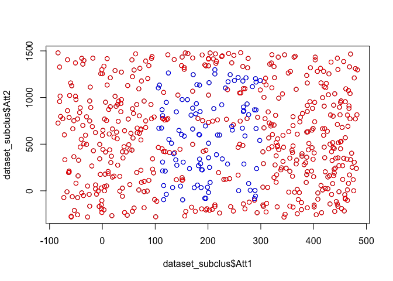

#### Conjunto de datos circle

A fin de tener una mejor imagen del conjunto de datos *circle*, se
visualiza un resumen de sus atributon. Del mismo modo, se cambia el
nombre de sus atributos por una cuestión de comodidad:

    summary(dataset_circle)

    ##        V1                V2                  V3      
    ##  Min.   :  4.442   Min.   :  0.5926   negative:2335  
    ##  1st Qu.:118.820   1st Qu.:118.3459   positive:  55  
    ##  Median :254.135   Median :249.1955                  
    ##  Mean   :254.997   Mean   :253.1674                  
    ##  3rd Qu.:389.010   3rd Qu.:389.8631                  
    ##  Max.   :508.239   Max.   :505.8055

    colnames(dataset_circle) <- c("Att1", "Att2", "Class")

Podemos visualizar en un gráfico de dispersión el conjunto de datos
anterior:

    plot(dataset_circle$Att1, dataset_circle$Att2)
    points(dataset_circle[dataset_circle$Class=="negative",1],
           dataset_circle[dataset_circle$Class=="negative",2],col="red")
    points(dataset_circle[dataset_circle$Class=="positive",1],
           dataset_circle[dataset_circle$Class=="positive",2],col="blue") 

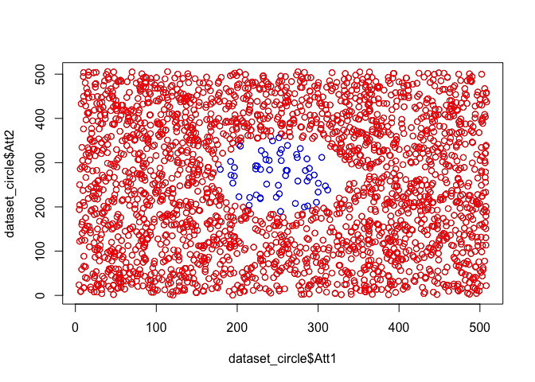

#### Conjunto de datos Iris0

Para llevar a cabo una comparativa entre diversos algoritmos de sampling
en el último punto de este informe, se ha utilizado el conjunto de datos
Iris0. Este dataset es de clasificación binaria y comprende casos
positivos y negativos acerca de la flor del Iris de acuerdo a medidas
del pétalo y sépalo:

    data(iris0)
    summary(iris0)

    ##   SepalLength      SepalWidth     PetalLength      PetalWidth   
    ##  Min.   :4.300   Min.   :2.000   Min.   :1.000   Min.   :0.100  
    ##  1st Qu.:5.100   1st Qu.:2.800   1st Qu.:1.600   1st Qu.:0.300  
    ##  Median :5.800   Median :3.000   Median :4.350   Median :1.300  
    ##  Mean   :5.843   Mean   :3.054   Mean   :3.759   Mean   :1.199  
    ##  3rd Qu.:6.400   3rd Qu.:3.300   3rd Qu.:5.100   3rd Qu.:1.800  
    ##  Max.   :7.900   Max.   :4.400   Max.   :6.900   Max.   :2.500  
    ##       Class    
    ##  negative:100  
    ##  positive: 50  
    ##                
    ##                
    ##                
    ## 

Análisis del efecto del desbalanceo en problemas de clasificación
=================================================================

En este epígrafe se analizarán las estrategias a nivel de datos ROS, RUS
y SMOTE para tratar con distribuciones de datos no balanceadas. Para
ello, en primer lugar se halla un modelo base de clasificación a
utilizar como referencia, para posteriormente mediante las respectivas
métricas de calidad, evaluar si los algoritmos de sampling utilizados
permiten mejorar. Como algoritmo de clasificación se utiliza k-NN en
todos los casos.

Modelo base de clasificación
----------------------------

En primer lugar, se genera un modelo de clasificación base sobre el cual
llevamos a cabo las distintas comparativas. Para todos los modelos
generados, llevaremos a cabo una división del conjunto de datos entre
train y test:

    # Semilla (Reproducibilidad del experimento)
    set.seed(42)
    # Índices para llevar a cabo la división
    dataset_subclus$Class <- relevel(dataset_subclus$Class,"positive")
    index <- createDataPartition(dataset_subclus$Class, p = 0.7, list = FALSE)
    # División del conjunto de datos
    train_data_subclus <- dataset_subclus[index, ]
    test_data_subclus  <- dataset_subclus[-index, ] 

A continuación, se entrena y se evalúa el modelo k-NN por medio 5-fold
cv para el dataset *subclus*, técnica que se utilizará en el resto de
ejecuciones de modelos de este trabajo:

    # 5-fold cv repetido 3 veces
    ctrl <- trainControl(method="repeatedcv",number=5,repeats = 3,
                         classProbs=TRUE, summaryFunction = twoClassSummary)
    # Entrenamiento del modelo k-NN con datos sin preprocesado
    model.raw_sc <- learn_model(train_data_subclus, ctrl, "RAW ")
    # Test de calidad del modelo
    cm.raw_sc <- test_model(test_data_subclus, model.raw_sc, "RAW ")

    ## Confusion Matrix and Statistics
    ## 
    ##           Reference
    ## Prediction positive negative
    ##   positive       16        2
    ##   negative       14      148
    ##                                           
    ##                Accuracy : 0.9111          
    ##                  95% CI : (0.8597, 0.9483)
    ##     No Information Rate : 0.8333          
    ##     P-Value [Acc > NIR] : 0.001979        
    ##                                           
    ##                   Kappa : 0.619           
    ##  Mcnemar's Test P-Value : 0.005960        
    ##                                           
    ##             Sensitivity : 0.53333         
    ##             Specificity : 0.98667         
    ##          Pos Pred Value : 0.88889         
    ##          Neg Pred Value : 0.91358         
    ##              Prevalence : 0.16667         
    ##          Detection Rate : 0.08889         
    ##    Detection Prevalence : 0.10000         
    ##       Balanced Accuracy : 0.76000         
    ##                                           
    ##        'Positive' Class : positive        
    ## 

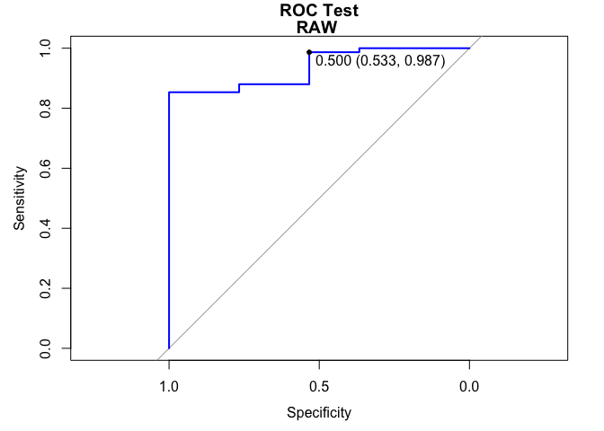

Y se hace lo mismo para el dataset *circle*, del cual observamos su
salida:

    ## Confusion Matrix and Statistics
    ## 
    ##           Reference
    ## Prediction positive negative
    ##   positive       13        0
    ##   negative        3      700
    ##                                           
    ##                Accuracy : 0.9958          
    ##                  95% CI : (0.9878, 0.9991)
    ##     No Information Rate : 0.9777          
    ##     P-Value [Acc > NIR] : 8.246e-05       
    ##                                           
    ##                   Kappa : 0.8944          
    ##  Mcnemar's Test P-Value : 0.2482          
    ##                                           
    ##             Sensitivity : 0.81250         
    ##             Specificity : 1.00000         
    ##          Pos Pred Value : 1.00000         
    ##          Neg Pred Value : 0.99573         
    ##              Prevalence : 0.02235         
    ##          Detection Rate : 0.01816         
    ##    Detection Prevalence : 0.01816         
    ##       Balanced Accuracy : 0.90625         
    ##                                           
    ##        'Positive' Class : positive        
    ## 

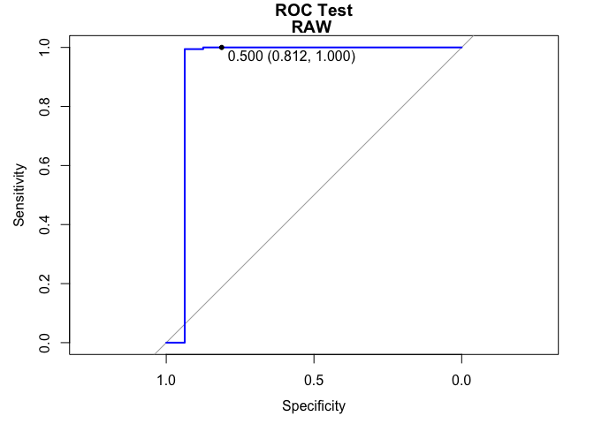

**Interpretación**: Se puede observar como en los datasets la clase
mayoritaria se predice correctamente (Specificity), mientras que la
minoritaria en se hace en menor medida (Sensitivity), siendo más claro
en el caso del dataset subclus. Así, el objetivo al utilizar los
algoritmos de resampling es aumentar la sensibilidad de nuestro modelo
(Capacidad predictiva sobre casos de la clase minoritaria).

Random Oversampling (ROS)
-------------------------

Se utiliza la técnica de Random OverSampling dentro del preprocesado de
nuestro conjunto de datos *subclus*:

    # Entrenamiento del modelo k-NN con datos aplicando ROS
    ctrl <- trainControl(method="repeatedcv", number = 5, repeats = 3,
                         classProbs=TRUE, summaryFunction = twoClassSummary, 
                         sampling = "up")
    model.os_sc <- learn_model(train_data_subclus, ctrl, "Over Sampling")
    cm.os_sc <- test_model(test_data_subclus, model.os_sc, "Over Sampling")

    ## Confusion Matrix and Statistics
    ## 
    ##           Reference
    ## Prediction positive negative
    ##   positive       29       23
    ##   negative        1      127
    ##                                           
    ##                Accuracy : 0.8667          
    ##                  95% CI : (0.8081, 0.9127)
    ##     No Information Rate : 0.8333          
    ##     P-Value [Acc > NIR] : 0.1344          
    ##                                           
    ##                   Kappa : 0.6289          
    ##  Mcnemar's Test P-Value : 1.814e-05       
    ##                                           
    ##             Sensitivity : 0.9667          
    ##             Specificity : 0.8467          
    ##          Pos Pred Value : 0.5577          
    ##          Neg Pred Value : 0.9922          
    ##              Prevalence : 0.1667          
    ##          Detection Rate : 0.1611          
    ##    Detection Prevalence : 0.2889          
    ##       Balanced Accuracy : 0.9067          
    ##                                           
    ##        'Positive' Class : positive        
    ## 

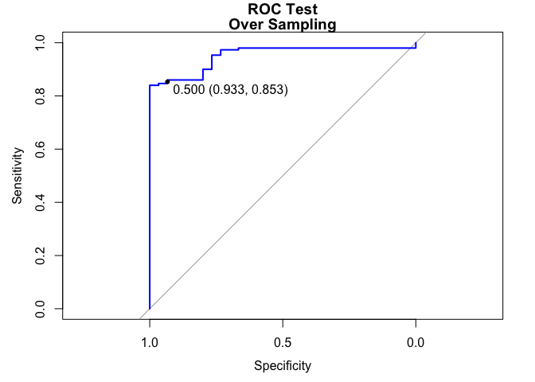

Y se hace lo mismo para el dataset *circle*, del cual observamos su
salida:

    ## Confusion Matrix and Statistics
    ## 
    ##           Reference
    ## Prediction positive negative
    ##   positive       16        7
    ##   negative        0      693
    ##                                         
    ##                Accuracy : 0.9902        
    ##                  95% CI : (0.98, 0.9961)
    ##     No Information Rate : 0.9777        
    ##     P-Value [Acc > NIR] : 0.009405      
    ##                                         
    ##                   Kappa : 0.8157        
    ##  Mcnemar's Test P-Value : 0.023342      
    ##                                         
    ##             Sensitivity : 1.00000       
    ##             Specificity : 0.99000       
    ##          Pos Pred Value : 0.69565       
    ##          Neg Pred Value : 1.00000       
    ##              Prevalence : 0.02235       
    ##          Detection Rate : 0.02235       
    ##    Detection Prevalence : 0.03212       
    ##       Balanced Accuracy : 0.99500       
    ##                                         
    ##        'Positive' Class : positive      
    ## 

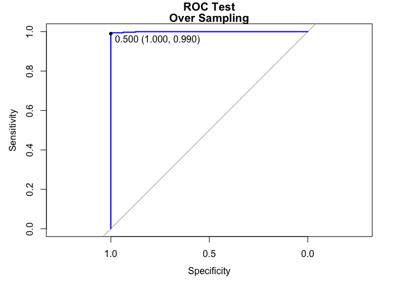

**Interpretación**: Se puede observar como en los datasets la clase
minoritaria se predice mejor que sin resampling (mejor Sensitivity),
pero a coste de reducir algo la predicción de la clase mayoritaria (peor
Specificity). Para ambos datasets se da dicha circustancia y en los dos
se mejora la precisión ajustada al desbalanceo de las clases (Balanced
Accuracy).

Random Undersampling (RUS)
--------------------------

Se utiliza la técnica de Random UnderSampling dentro del preprocesado de
nuestro conjunto de datos *subclus*:

    # Entrenamiento del modelo k-NN con datos aplicando RUS
    ctrl <- trainControl(method="repeatedcv",number=5,repeats = 3,
                         classProbs=TRUE,summaryFunction = twoClassSummary,
                         sampling = "down")
    model.us_sc <- learn_model(train_data_subclus, ctrl, "Under Sampling")
    cm.us_sc <- test_model(test_data_subclus, model.us_sc, "Under Sampling")

    ## Confusion Matrix and Statistics
    ## 
    ##           Reference
    ## Prediction positive negative
    ##   positive       29       24
    ##   negative        1      126
    ##                                           
    ##                Accuracy : 0.8611          
    ##                  95% CI : (0.8018, 0.9081)
    ##     No Information Rate : 0.8333          
    ##     P-Value [Acc > NIR] : 0.1851          
    ##                                           
    ##                   Kappa : 0.6173          
    ##  Mcnemar's Test P-Value : 1.083e-05       
    ##                                           
    ##             Sensitivity : 0.9667          
    ##             Specificity : 0.8400          
    ##          Pos Pred Value : 0.5472          
    ##          Neg Pred Value : 0.9921          
    ##              Prevalence : 0.1667          
    ##          Detection Rate : 0.1611          
    ##    Detection Prevalence : 0.2944          
    ##       Balanced Accuracy : 0.9033          
    ##                                           
    ##        'Positive' Class : positive        
    ## 

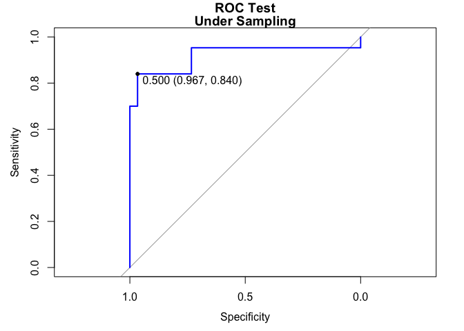

Y se hace lo mismo para el dataset *circle*, del cual observamos su
salida:

    ## Confusion Matrix and Statistics
    ## 
    ##           Reference
    ## Prediction positive negative
    ##   positive       16      201
    ##   negative        0      499
    ##                                           
    ##                Accuracy : 0.7193          
    ##                  95% CI : (0.6848, 0.7519)
    ##     No Information Rate : 0.9777          
    ##     P-Value [Acc > NIR] : 1               
    ##                                           
    ##                   Kappa : 0.0999          
    ##  Mcnemar's Test P-Value : <2e-16          
    ##                                           
    ##             Sensitivity : 1.00000         
    ##             Specificity : 0.71286         
    ##          Pos Pred Value : 0.07373         
    ##          Neg Pred Value : 1.00000         
    ##              Prevalence : 0.02235         
    ##          Detection Rate : 0.02235         
    ##    Detection Prevalence : 0.30307         
    ##       Balanced Accuracy : 0.85643         
    ##                                           
    ##        'Positive' Class : positive        
    ## 

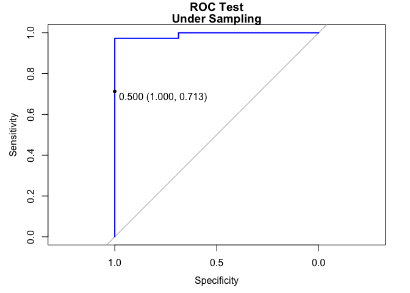

**Interpretación**: Se puede observar como en los datasets la clase
minoritaria se predice mejor que sin resampling (mejor Sensitivity),
pero a coste de reducir bastante la predicción de la clase mayoritaria
(peor Specificity). En general se obtienen peores resultados que con
ROS, estando también la precisión bastante por debajo.

Synthetic Minority Oversampling Technique (SMOTE)
-------------------------------------------------

Se utiliza la técnica de SMOTE dentro del preprocesado de nuestro
conjunto de datos *subclus*:

    # Entrenamiento del modelo k-NN con datos aplicando SMOTE
    ctrl <- trainControl(method="repeatedcv",number=5,repeats = 3,
                         classProbs=TRUE, summaryFunction = twoClassSummary,
                         sampling = "smote")
    model.smt_sc <- learn_model(train_data_subclus, ctrl, "SMOTE")

    ## Loading required package: grid

    cm.smt_sc <- test_model(test_data_subclus, model.smt_sc, "SMOTE")

    ## Confusion Matrix and Statistics
    ## 
    ##           Reference
    ## Prediction positive negative
    ##   positive       26       21
    ##   negative        4      129
    ##                                           
    ##                Accuracy : 0.8611          
    ##                  95% CI : (0.8018, 0.9081)
    ##     No Information Rate : 0.8333          
    ##     P-Value [Acc > NIR] : 0.185104        
    ##                                           
    ##                   Kappa : 0.5924          
    ##  Mcnemar's Test P-Value : 0.001374        
    ##                                           
    ##             Sensitivity : 0.8667          
    ##             Specificity : 0.8600          
    ##          Pos Pred Value : 0.5532          
    ##          Neg Pred Value : 0.9699          
    ##              Prevalence : 0.1667          
    ##          Detection Rate : 0.1444          
    ##    Detection Prevalence : 0.2611          
    ##       Balanced Accuracy : 0.8633          
    ##                                           
    ##        'Positive' Class : positive        
    ## 

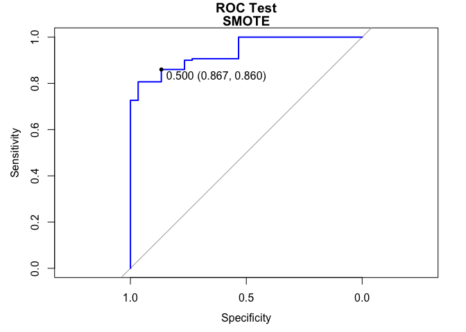

Y se hace lo mismo para el dataset *circle*, del cual observamos su
salida:

    ## Confusion Matrix and Statistics
    ## 
    ##           Reference
    ## Prediction positive negative
    ##   positive       16       44
    ##   negative        0      656
    ##                                          
    ##                Accuracy : 0.9385         
    ##                  95% CI : (0.9184, 0.955)
    ##     No Information Rate : 0.9777         
    ##     P-Value [Acc > NIR] : 1              
    ##                                          
    ##                   Kappa : 0.3999         
    ##  Mcnemar's Test P-Value : 9.022e-11      
    ##                                          
    ##             Sensitivity : 1.00000        
    ##             Specificity : 0.93714        
    ##          Pos Pred Value : 0.26667        
    ##          Neg Pred Value : 1.00000        
    ##              Prevalence : 0.02235        
    ##          Detection Rate : 0.02235        
    ##    Detection Prevalence : 0.08380        
    ##       Balanced Accuracy : 0.96857        
    ##                                          
    ##        'Positive' Class : positive       
    ## 

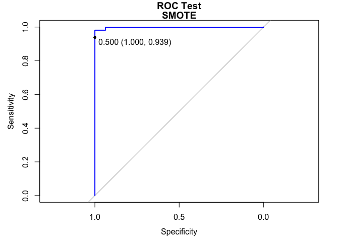

**Interpretación**: Se puede observar como con SMOTE, la predicción de
la clase minoritaria es buena, si bien con ROS era algo mejor en el
conjunto *subclus*. En general, ofrece un buen equilibrio entre la
sensibilidad y la especificidad, pues no penaliza tanto la predicción de
la clase mayoritaria en pro de una mejor predicción de la minoritaria,
si bien se ve una clara mejoría en ella.

Resumen de los algoritmos
-------------------------

A continuación, se puede apreciar de forma gráfica un resumen de las
principales medidas de calidad que resultan de interés según los
objetivos del proyecto.

En primer lugar apreciamos una comparativa entre ROC, sensiblidad y
especificidad para el conjunto *subclus*:

    resampling_sc <- resamples(models_sc)
    bwplot(resampling_sc)

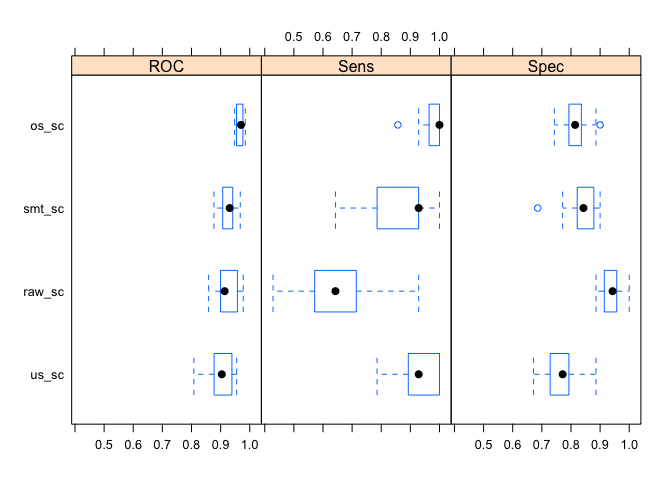

Y lo mismo para el conjunto *circle*:

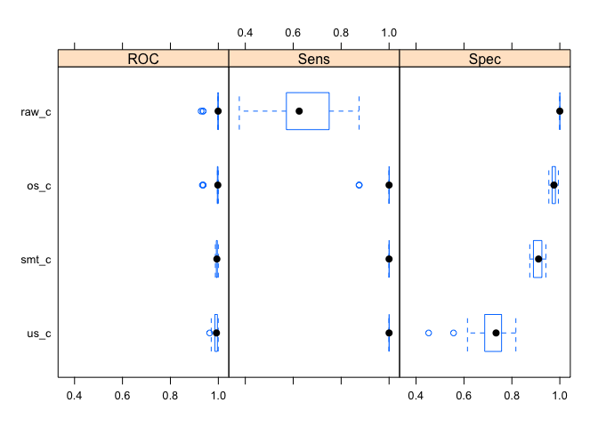

**Interpretación**: Se puede apreciar para ambos conjuntos como la
diferencia entre el modelo base sin preprocesado y los distintos métodos
es significativa y cumple ciertos patrones. En cualquiera de los casos,
la especificidad es penalizada al aplicar cualquiera de los algoritmos
con respecto al modelo base, mientras que aumenta la sensibilidad
notablemente y en mayor grado en el ROS.

Del mismo modo, también se puede representar gráficamente un mayor
abanico de medidas que resultan de interés, en primer lugar, para el
análisis del efecto de los algoritmos de sampling el el dataset
*subclus*:

    comparison_sc %>%
        gather(x, y, Sensitivity:F1) %>%
        ggplot(aes(x = x, y = y, color = model)) +
        geom_jitter(width = 0.2, alpha = 0.5, size = 3)

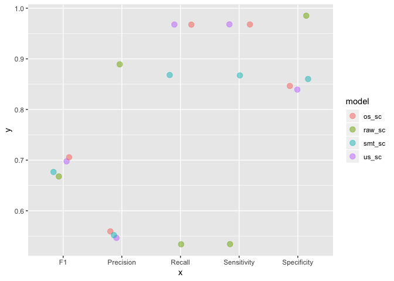

Y lo mismo para el conjunto *circle*:

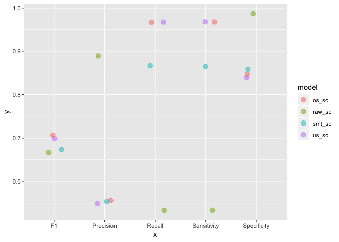

**Interpretación**: A diferencia de los gráficos anteriores, en estos se
representa el F1-score, donde apreciamos que para ambos datasets, el
algoritmo que mejor equilibrio consigue entre la precisión y la
exhaustividad de nuestro modelo.

Paquete imbalance y combinación de técnicas
===========================================

Técnicas disponibles en el paquete
----------------------------------

### PDFOS

Efecto del algoritmo de sampling Probability Density Function (PDF)
estimation based Over-Sampling (PDFOS):

    train_data_sc_pdfos <- imbalance::oversample(dataset = train_data_subclus, 
                                                 method = "PDFOS", ratio = 0.5)
    imbalance::plotComparison(train_data_subclus, train_data_sc_pdfos, 
                              attrs = names(train_data_sc_pdfos)[-ncol(train_data_sc_pdfos)], 
                              classAttr = names(train_data_sc_pdfos)[ncol(train_data_sc_pdfos)])

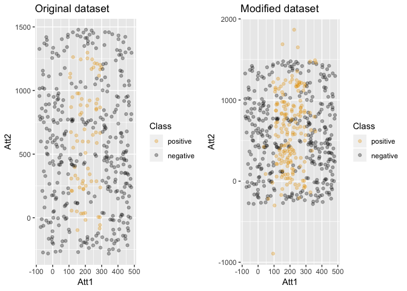

Se realiza el mismo análisis sobre el conjunto de datos *circle*:

    train_data_c_pdfos <- imbalance::oversample(dataset = train_data_circle, 
                                                method = "PDFOS", ratio = 0.5)
    imbalance::plotComparison(train_data_circle, train_data_c_pdfos, 
                              attrs = names(train_data_c_pdfos)[-ncol(train_data_c_pdfos)], 
                              classAttr = names(train_data_c_pdfos)[ncol(train_data_c_pdfos)])

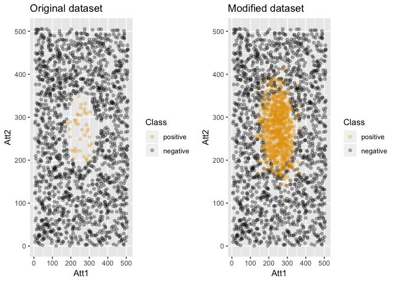

### RWO

Efecto del algoritmo de sampling Windowed Regression Over-sampling (RWO)
sobre el dataset *subclus*:

    train_data_sc_rwo <- imbalance::oversample(dataset = train_data_subclus, 
                                               method = "RWO", ratio = 0.5)
    imbalance::plotComparison(train_data_subclus, train_data_sc_rwo, 
                              attrs = names(train_data_sc_rwo)[-ncol(train_data_sc_rwo)], 
                              classAttr = names(train_data_sc_rwo)[ncol(train_data_sc_rwo)])

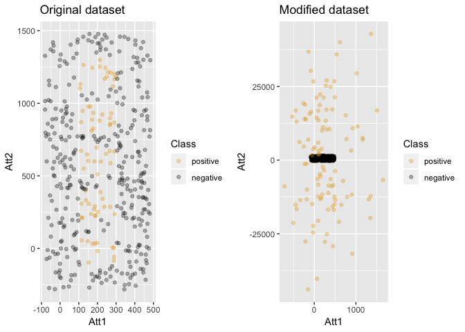

Se realiza el mismo análisis sobre el conjunto de datos *circle*:

    train_data_c_rwo <- imbalance::oversample(dataset = train_data_circle, 
                                              method = "RWO", ratio = 0.5)
    imbalance::plotComparison(train_data_circle, train_data_c_rwo, 
                              attrs = names(train_data_c_rwo)[-ncol(train_data_c_rwo)], 
                              classAttr = names(train_data_c_rwo)[ncol(train_data_c_rwo)])

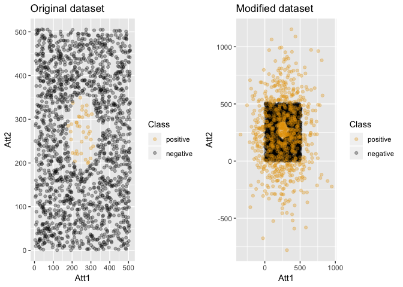

### ADASYN

Efecto del algoritmo de sampling Adaptive Synthetic (ADASYN) sobre el
dataset *subclus*:

    train_data_sc_adasyn <- imbalance::oversample(dataset = train_data_subclus, 
                                                  method = "ADASYN")
    imbalance::plotComparison(train_data_subclus, train_data_sc_adasyn, 
                              attrs = names(train_data_sc_adasyn)[-ncol(train_data_sc_adasyn)], 
                              classAttr = names(train_data_sc_adasyn)[ncol(train_data_sc_adasyn)])

Se realiza el mismo análisis sobre el conjunto de datos *circle*:

    train_data_c_adasyn <- imbalance::oversample(dataset = train_data_circle, 
                                                 method = "ADASYN")
    imbalance::plotComparison(train_data_circle, train_data_c_adasyn, 
                              attrs = names(train_data_c_adasyn)[-ncol(train_data_c_adasyn)], 
                              classAttr = names(train_data_c_adasyn)[ncol(train_data_c_adasyn)])

### ANSMOTE

Efecto del algoritmo de sampling ANSMOTE sobre el dataset *subclus*:

    train_data_sc_ansmote <- imbalance::oversample(dataset = train_data_subclus, 
                                                   method = "ANSMOTE", ratio = 0.5)

    ## [1] "ANS is done"

    imbalance::plotComparison(train_data_subclus, train_data_sc_ansmote, 
                              attrs = names(train_data_sc_ansmote)[-ncol(train_data_sc_ansmote)], 
                              classAttr = names(train_data_sc_ansmote)[ncol(train_data_sc_ansmote)])

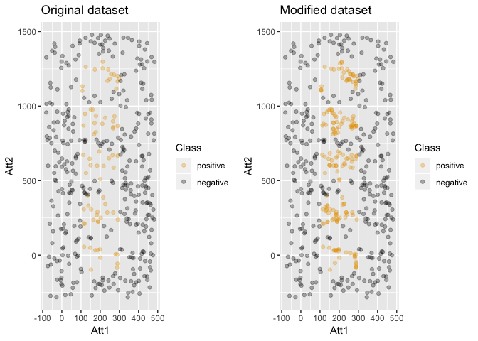

Se realiza el mismo análisis sobre el conjunto de datos *circle*:

    train_data_c_ansmote <- imbalance::oversample(dataset = train_data_circle, 
                                                  method = "ANSMOTE", ratio = 0.5)

    ## [1] "ANS is done"

    imbalance::plotComparison(train_data_circle, train_data_c_ansmote, 
                              attrs = names(train_data_c_ansmote)[-ncol(train_data_c_ansmote)], 
                              classAttr = names(train_data_c_ansmote)[ncol(train_data_c_ansmote)])

### MWMOTE

Efecto del algoritmo de sampling MWMOTE sobre el dataset *subclus*:

    train_data_sc_mwmote <- imbalance::oversample(dataset = train_data_subclus, 
                                                  method = "MWMOTE", ratio = 0.5)
    imbalance::plotComparison(train_data_subclus, train_data_sc_mwmote, 
                              attrs = names(train_data_sc_mwmote)[-ncol(train_data_sc_mwmote)], 
                              classAttr = names(train_data_sc_mwmote)[ncol(train_data_sc_mwmote)])

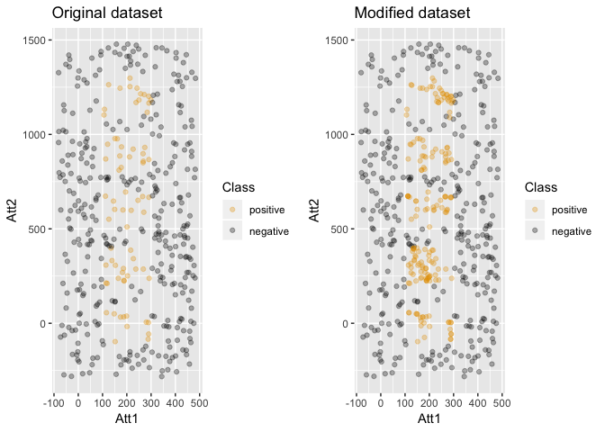

Se realiza el mismo análisis sobre el conjunto de datos *circle*:

    train_data_c_mwmote <- imbalance::oversample(dataset = train_data_circle, 
                                                 method = "MWMOTE", ratio = 0.5)
    imbalance::plotComparison(train_data_circle, train_data_c_mwmote, 
                              attrs = names(train_data_c_mwmote)[-ncol(train_data_c_mwmote)], 
                              classAttr = names(train_data_c_mwmote)[ncol(train_data_c_mwmote)])

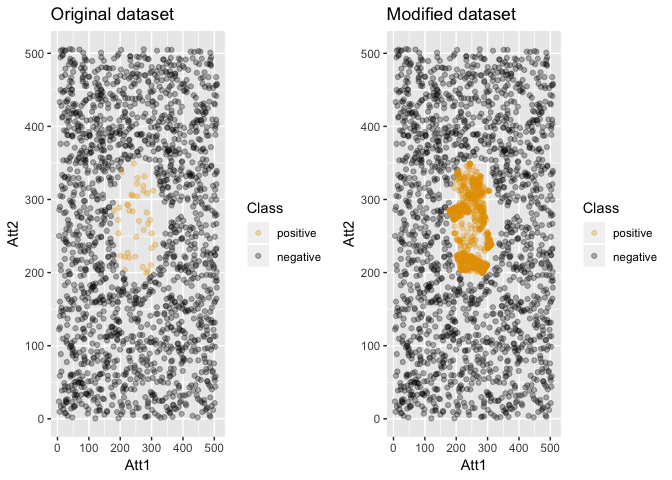

### BLSMOTE

Efecto del algoritmo de sampling BLSMOTE sobre el dataset *subclus*:

    train_data_sc_blsmote <- imbalance::oversample(dataset = train_data_subclus, 
                                                   method = "BLSMOTE", ratio = 0.5)

    ## [1] "Borderline-SMOTE done"

    imbalance::plotComparison(train_data_subclus, train_data_sc_blsmote, 
                              attrs = names(train_data_sc_blsmote)[-ncol(train_data_sc_blsmote)], 
                              classAttr = names(train_data_sc_blsmote)[ncol(train_data_sc_blsmote)])

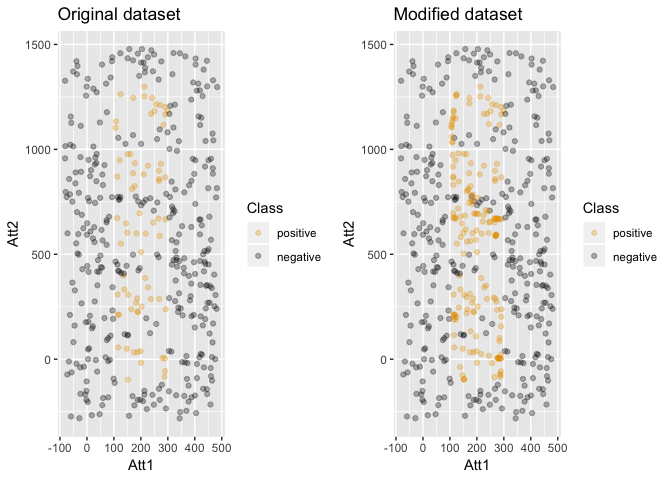

Se realiza el mismo análisis sobre el conjunto de datos *circle*:

    train_data_c_blsmote <- imbalance::oversample(dataset = train_data_circle, 
                                                  method = "BLSMOTE", ratio = 0.5)

    ## [1] "Borderline-SMOTE done"

    imbalance::plotComparison(train_data_circle, train_data_c_blsmote, 
                              attrs = names(train_data_c_blsmote)[-ncol(train_data_c_blsmote)], 
                              classAttr = names(train_data_c_blsmote)[ncol(train_data_c_blsmote)])

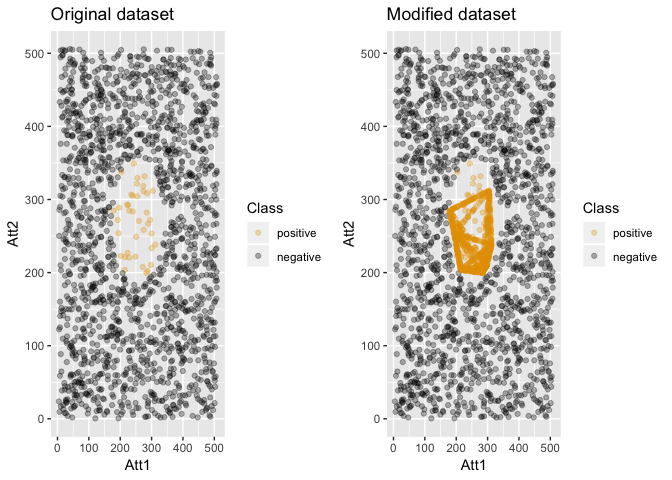

### DBSMOTE

Efecto del algoritmo de sampling DBSMOTE sobre el dataset *subclus*:

    train_data_sc_dbsmote <- imbalance::oversample(dataset = train_data_subclus, 
                                                   method = "DBSMOTE", ratio = 0.5)

    ## [1] 2
    ## [1] 2
    ## [1] 2
    ## [1] 3
    ## [1] 2
    ## [1] 2
    ## [1] 3
    ## [1] 2
    ## [1] 2
    ## [1] 2
    ## [1] 2
    ## [1] 2
    ## [1] 3
    ## [1] 4
    ## [1] 2
    ## [1] 3
    ## [1] 2
    ## [1] 2
    ## [1] 2
    ## [1] 2
    ## [1] 2
    ## [1] 4
    ## [1] 3
    ## [1] 3
    ## [1] 3
    ## [1] 2
    ## [1] 3
    ## [1] 2
    ## [1] 3
    ## [1] 2
    ## [1] 3
    ## [1] 2
    ## [1] 2
    ## [1] 4
    ## [1] 2
    ## [1] 2
    ## [1] 2
    ## [1] 3
    ## [1] 2
    ## [1] 3
    ## [1] 2
    ## [1] 2
    ## [1] 3
    ## [1] 3
    ## [1] 3
    ## [1] 3
    ## [1] 2
    ## [1] 2
    ## [1] 2
    ## [1] 3
    ## [1] 2
    ## [1] 3
    ## [1] 2
    ## [1] 2
    ## [1] 2
    ## [1] 2
    ## [1] 2
    ## [1] 3
    ## [1] 2
    ## [1] 3
    ## [1] 2
    ## [1] 2
    ## [1] "DBSMOTE is Done"

    imbalance::plotComparison(train_data_subclus, train_data_sc_dbsmote, 
                              attrs = names(train_data_sc_dbsmote)[-ncol(train_data_sc_dbsmote)], 
                              classAttr = names(train_data_sc_dbsmote)[ncol(train_data_sc_dbsmote)])

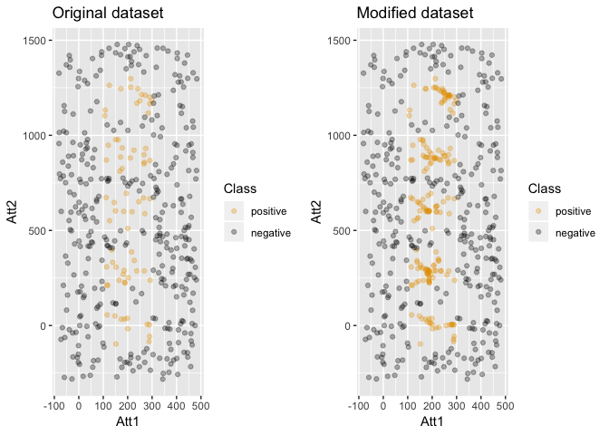

Se realiza el mismo análisis sobre el conjunto de datos *circle*:

    train_data_c_dbsmote <- imbalance::oversample(dataset = train_data_circle, 
                                                  method = "DBSMOTE", ratio = 0.5)

    ## [1] 3
    ## [1] 2
    ## [1] 5
    ## [1] 3
    ## [1] 5
    ## [1] 3
    ## [1] 2
    ## [1] 4
    ## [1] 5
    ## [1] 5
    ## [1] 5
    ## [1] 5
    ## [1] 4
    ## [1] 4
    ## [1] 3
    ## [1] 5
    ## [1] 3
    ## [1] 2
    ## [1] 3
    ## [1] 4
    ## [1] 3
    ## [1] 4
    ## [1] 2
    ## [1] 4
    ## [1] 6
    ## [1] 3
    ## [1] 4
    ## [1] 3
    ## [1] 4
    ## [1] 4
    ## [1] 2
    ## [1] 4
    ## [1] 5
    ## [1] 3
    ## [1] 4
    ## [1] 3
    ## [1] 4
    ## [1] "DBSMOTE is Done"

    imbalance::plotComparison(train_data_circle, train_data_c_dbsmote, 
                              attrs = names(train_data_c_dbsmote)[-ncol(train_data_c_dbsmote)], 
                              classAttr = names(train_data_c_dbsmote)[ncol(train_data_c_dbsmote)])

### SLMOTE

Efecto del algoritmo de sampling SLMOTE sobre el dataset *subclus*:

    train_data_sc_slmote <- imbalance::oversample(dataset = train_data_subclus, 
                                                  method = "SLMOTE", ratio = 0.5)

    ## [1] "SLS done"

    imbalance::plotComparison(train_data_subclus, train_data_sc_slmote, 
                              attrs = names(train_data_sc_slmote)[-ncol(train_data_sc_slmote)], 
                              classAttr = names(train_data_sc_slmote)[ncol(train_data_sc_slmote)])

Se realiza el mismo análisis sobre el conjunto de datos *circle*:

    train_data_c_slmote <- imbalance::oversample(dataset = train_data_circle, 
                                                 method = "SLMOTE", ratio = 0.5)

    ## [1] "SLS done"

    imbalance::plotComparison(train_data_circle, train_data_c_slmote, 
                              attrs = names(train_data_c_slmote)[-ncol(train_data_c_slmote)], 
                              classAttr = names(train_data_c_slmote)[ncol(train_data_c_slmote)])

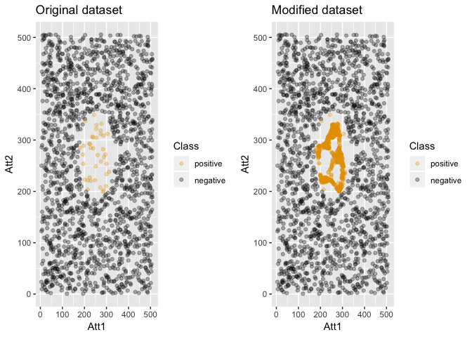

### RSLSMOTE

Efecto del algoritmo de sampling RSLSMOTE sobre el dataset *subclus*:

    train_data_sc_rslsmote <- imbalance::oversample(dataset = train_data_subclus, 
                                                    method = "RSLSMOTE", ratio = 0.5)

    ## [1] "RSLS is done"

    imbalance::plotComparison(train_data_subclus, train_data_sc_rslsmote, 
                              attrs = names(train_data_sc_rslsmote)[-ncol(train_data_sc_rslsmote)], 
                              classAttr = names(train_data_sc_rslsmote)[ncol(train_data_sc_rslsmote)])

Se realiza el mismo análisis sobre el conjunto de datos *circle*:

    train_data_c_rslsmote <- imbalance::oversample(dataset = train_data_circle, 
                                                   method = "SLMOTE", ratio = 0.5)

    ## [1] "SLS done"

    imbalance::plotComparison(train_data_circle, train_data_c_rslsmote, 
                              attrs = names(train_data_c_rslsmote)[-ncol(train_data_c_rslsmote)], 
                              classAttr = names(train_data_c_rslsmote)[ncol(train_data_c_rslsmote)])

Comparativa entre las distintas técnicas
----------------------------------------

A continuación, se representa en un diagrama el resultado de la
ejecución de modelos k-NN entrenados con los datos previamente
modificados mediante los algoritmos mostrados anteriormente. En primer
lugar se muestra el resultado de la predicción sobre el conjunto de test
para el dataset *subclus*:

    comparison_sc %>%
        gather(x, y, Sensitivity:F1) %>%
        ggplot(aes(x = x, y = y, color = model)) +
        geom_jitter(width = 0.2, alpha = 0.5, size = 3) +
        ggtitle("Comparativa de los algoritmos para subclus")

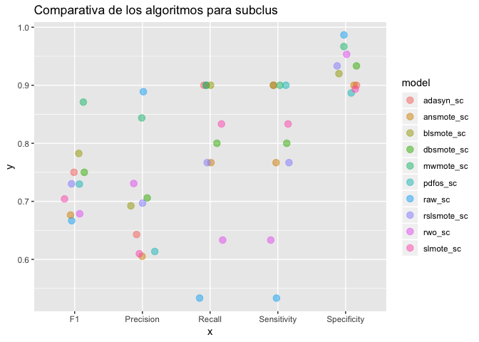

**Interpretación**: Para este conjunto de datos, se puede apreciar que
el algoritmo que mejor equilibrio consigue entre la precisión y la
exhaustividad de nuestro modelo es el DBSMOTE. Así, DBSMOTE también
consigue la mejor precisión y es el algoritmo que mejor predice la clase
mayoritaria, obteniendo la mejor especcificidad. Por su parte, el
algoritmo que mejor predice la clase minoritaria es ADASYN.

Se lleva a cabo la misma comparativa pero para el conjunto de datos
*circle*:

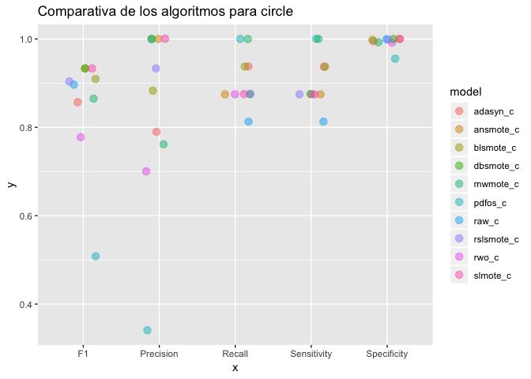

**Interpretación**: Para este conjunto de datos, hay tres algoritmos que
consiguen un buen equilibrio entre la precisión y la exhaustividad,
siendo estos ANSMOTE, DBSMOTE y RSLSMOTE. Así, los algoritmos que mayor
precisión tienen seran pues estos mismos tres. MWMOTE y PDFOS son los
algoritmos que mejor predicen la clase minoritaria, mientras que para
este conjunto de datos concreto, todos los algoritmos consiguen una
especificidad perfecta o casi perfecta.

Comparativa entre las distintas técnicas para conjunto de datos Iris0
---------------------------------------------------------------------

La misma comparativa efectuada para los conjuntos de datos *circle* y
*subclus*, será llevada a cabo para el conjunto de datos Iris0, cuyo
gráfico de modelos k-NN resultantes tras la aplicación de cada uno de
los distintos algoritmos de sampling puede ser observada a continuación:

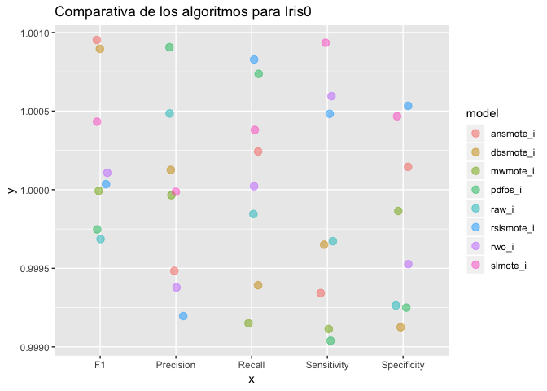

**Interpretación**: Para este conjunto de datos, se puede apreciar como
aun inbalanceado, la clasificación que hace el modelo sin aplicar
algoritmos de sampling es perfecta, obteniendo una F1-score y precisión
de 1 y por tanto, prediciendo perfectamente la clase mayoritaria y
minoritaria. Los algoritmos que disminuyen la sensibilidad de nuestro
modelo son en este caso, el RSLSMOTE y el SLMOTE.
